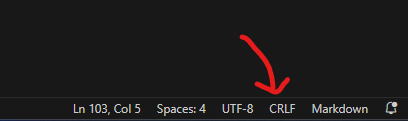

# Medical_App

# Medical App Structure

This repository contains a FastAPI-based application for managing medical information. Below is the directory structure and brief descriptions of each file/folder:
### Structure:
```
.
└── Medical_app
    ├── app
    |    ├── __init__.py  
    |    ├── medical_info.py  
    |    ├── database.py 
    |    ├── main.py  
    |    ├── schemas.py  
    |    └── routers
    |        ├── __init__.py  
    |        ├── respiratory.py  
    |        ├── urinary.py  
    |        ├── git.py  
    |        ├── pediatric.py  
    |        └── miscellaneous.py  
    └── MedicalInfoDB
    |        ├── import.sh  
    |        ├── GIT Diseases.json  
    |        ├── Urinary Tract Diseases.json  
    |        ├── photos.json  
    |        ├── Pediatric Emergency.json  
    |        ├── Respiratory Diseases.json  
    |        └── Miscellaneous.json  
    ├── Dockerfile 
    ├── docker-compose.yml 
    ├── requirements.txt 
    ├── README.md
```
### File Descriptions:

- `medical_app/`: Root directory for the FastAPI application.
- `medical_app/app/medical_info.py`: File containing functions for CRUD operations.
- `medical_app/app/database.py`: Manages the database connection.
- `medical_app/app/main.py`: Main entry point for the FastAPI application.
- `medical_app/app/schemas.py`: Defines Pydantic models for validation and serialization.
- `medical_app/app/routers/`: Directory containing different route handlers.
- `medical_app/app/routers/__init__.py`: Empty file indicating it's a Python package.
- `medical_app/app/routers/respiratory.py`: Routes related to respiratory diseases.
- `medical_app/app/routers/urinary.py`: Routes related to urinary tract diseases.
- `medical_app/app/routers/git.py`: Routes related to gastrointestinal diseases.
- `medical_app/app/routers/pediatric.py`: Routes related to pediatric emergencies.
- `medical_app/app/routers/miscellaneous.py`: Routes related to miscellaneous diseases.
- `medical_app/MedicalInfoDB/import.sh`: bash code that will import database.
- `medical_app/MedicalInfoDB/GIT Diseases.json`: gastrointestinal diseases metadata.
- `medical_app/MedicalInfoDB/Urinary Tract Diseases.json`: urinary tract diseases metadata.
- `medical_app/MedicalInfoDB/photos.json`: illness photos metadata.
- `medical_app/MedicalInfoDB/Pediatric Emergency.json`: pediatric emergencies metadata.
- `medical_app/MedicalInfoDB/Respiratory Diseases.json`: Respiratory Diseases metadata.
- `medical_app/MedicalInfoDB/Miscellaneous.json`: Miscellaneous diseases metadata.
- `medical_app/Dockerfile`: file that will create a container to run the api.
- `medical_app/docker-compose.yml`: docker compose file that will import the database & run the docker file.
- `medical_app/requirements.txt`: python library that will be used in the project.
- `medical_app/README.md`: readme file.

navigate to the working directory of this project 
for linux
```bash
cd path/to/Medical_app/
```
for windows
```bash
cd path\to\Medical_app\
```
### for linux os
### access for read&write
in your terminal / CMD run the following command to give docker permission to run bash script in the import.sh file
```bash
 chmod +x MedicalInfoDB/import.sh
```
to check that you have the permission run the following command 
```bash
ls -l MedicalInfoDB/import.sh
```
you suppose to see the following output


### for windows os
### handle the conversion of line endings
in the Medical_App directory 
navigate to import.sh file that is exist in MedicalInfoDB folder

```bash
.\MedicalInfoDB\import.sh
```
1. *Open the Script File*: Open your script file (`import.sh`) in Visual Studio Code.

2. *Change Line Endings*:

    *.*Go to the bottom right corner of the window where it says the file encoding (e.g., UTF-8).
    
    *.*Click on it and select "LF" (Unix) as the line ending format.
    
3. *Save the File*: After changing the line endings, save the file.


### running docker compose
now its time to run the compose file
```bash
docker-compose up -d
```

Now you can go to http://localhost/docs

You will see the automatic interactive API documentation (provided by Swagger UI):


if you want to close the container run the following commadn

```bash
docker-compose down
```